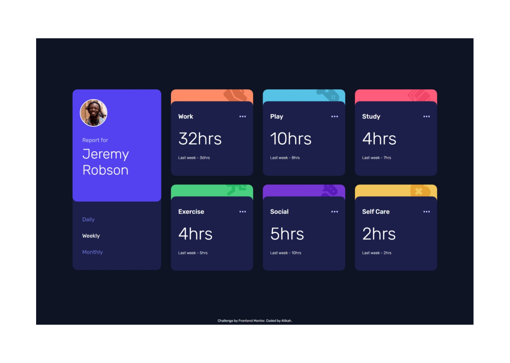
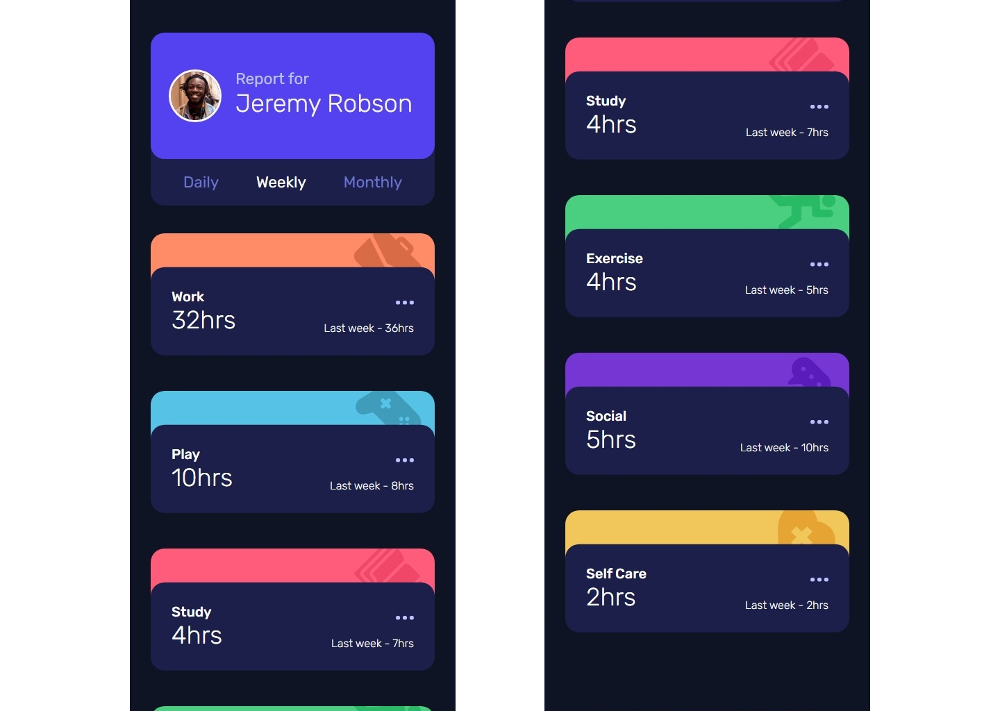

# Frontend Mentor - Time tracking dashboard solution

This is a solution to the [Time tracking dashboard challenge on Frontend Mentor](https://www.frontendmentor.io/challenges/time-tracking-dashboard-UIQ7167Jw). Frontend Mentor challenges help you improve your coding skills by building realistic projects. 

## Table of contents

- [Overview](#overview)
  - [The challenge](#the-challenge)
  - [Screenshot](#screenshot)
  - [Links](#links)
- [My process](#my-process)
  - [Built with](#built-with)
  - [What I learned](#what-i-learned)
  - [Continued development](#continued-development)
  - [Useful resources](#useful-resources)
- [Author](#author)
- [Acknowledgments](#acknowledgments)

**Note: Delete this note and update the table of contents based on what sections you keep.**

## Overview

### The challenge

Users should be able to:

- View the optimal layout for the site depending on their device's screen size
- See hover states for all interactive elements on the page
- Switch between viewing Daily, Weekly, and Monthly stats

### Screenshot




### Links

- Solution URL: [Github](https://github.com/atikahnaz/time-tracking-dashboard-main/blob/main/index.html)
- Live Site URL: [Add live site URL here](https://your-live-site-url.com)

## My process

### Built with

- Semantic HTML5 markup
- CSS custom properties
- Flexbox
- CSS Grid
- Mobile-first workflow

### What I learned

1. convert json to javascript object
  - res.json(): Specific to the Fetch API's Response object.
  - JSON.parse(): This is a standalone JavaScript function that is used to parse a JSON string into a JavaScript object

2. document.querySelector and document.querySelectorAll
  - provide more flexibility and versatility in selecting elements using various types of selectors (class names, IDs, etc.).

3. To change navigation text to original color
```css
const weekly = document.querySelector('.weekly');
weekly.style.color = '';
```

4. To handle different format image file name and variable name.
```css
const imageName = item.title.replace(/\s+/g, '-').toLowerCase(); // Replace spaces with hyphens and convert to lowercase
cardBox.style.backgroundImage = `url("images/icon-${imageName}.svg")`;
```

### Useful resources

- [CSS Grid](https://css-tricks.com/snippets/css/complete-guide-grid/) 

## Author

- Github - [Atikah](https://github.com/atikahnaz)
- Frontend Mentor - [@atikahnaz](https://www.frontendmentor.io/profile/atikahnaz)